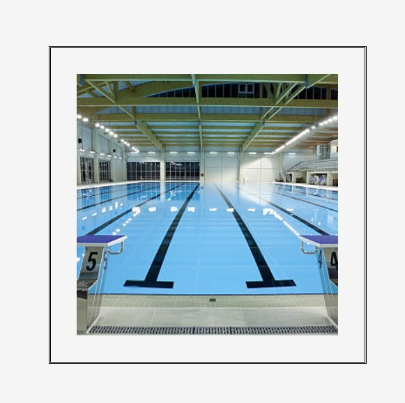
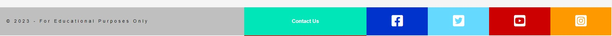
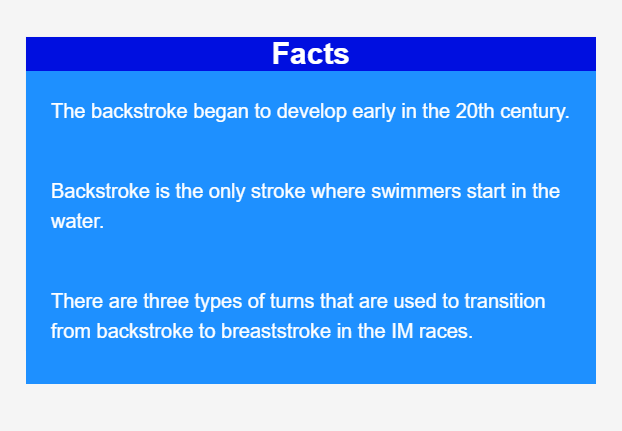
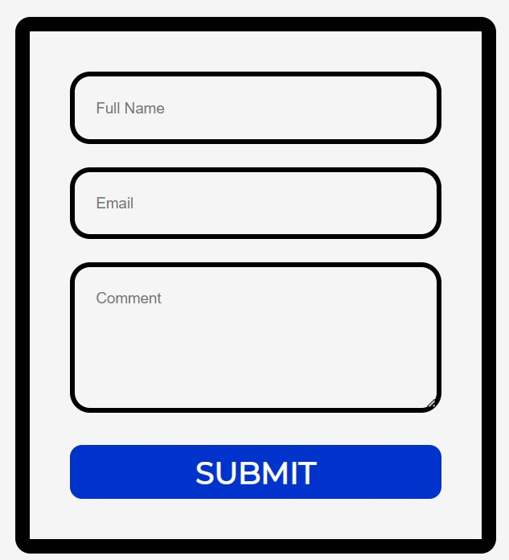
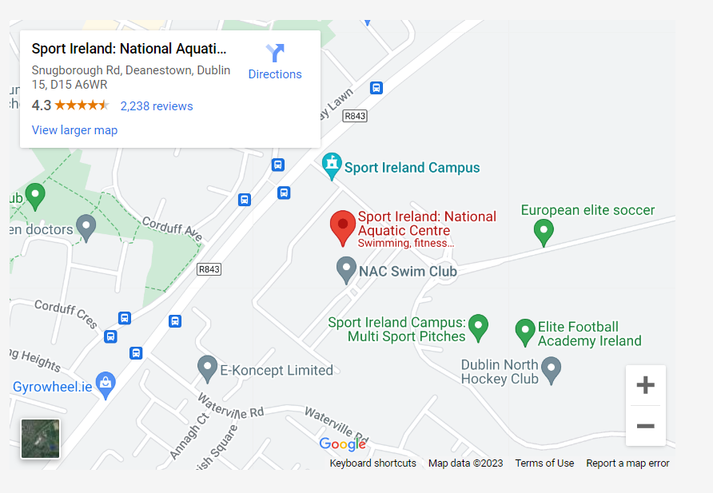
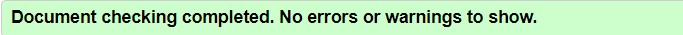

# **Armada Swimming Club**

### Armada Swimming Club is a site that hopes to attract competitive swimmers to join our swimming club. The site will be targeted towards competitive swimmers, who wish to improve their technique, times, strength, performance and potentially join the national team.Armada Swimming Club will support each swimmer during this transition and everything that they need to succeed in their swimming career. Armada Swimming Club will be useful for swimmers to see exactly what we offer if they decide to join our swimming club.

 
 

# Contents
 ## User Experience UX
 ## Wireframes
 ## Site Structure
 ## Design Choices
 ## Typography
 ## Colour Scheme

## Features
   * Existing Features
     - Navigation Bar
     - Picture of the Swimming Pool
     - Club Benefits
     - Footer
     -  Gallery
     - Contact Us Page
     - Thank You Page

## Features left to Implement
   * Navigation Bar
   * Media Queries
   * Additional Pages

## Technologies Used
## Testing
## Deployment
## Credits

 

 

# Features

## Existing Features:

* Navigation Bar:

   - Featured on all three pages, the full responsive navigation bar includes links to the Logo, Home page, Gallery and Sign Up page and is identical in each page to allow for easy navigation.

   - This section will allow the user to easily navigate from page to page across all devices without having to revert back to the previous page via the ‘back’ button.

 

 

 

* Picture of the Swimming Pool:

   - The picture in the middle shows exactly how the swimming pool looks like.

   - This section includes border line which is eye catching for the user to grab their attention.

 

 

 

* Club Benefits:

   - The club special offer section will allow the user to see the benefits of joining Armada Swimming Club.

   - The user will see what the club offers when signing up to the Armada Swimming Club. This should encourage the user to 
     consider our club in pursuing their future swimming career with us.

 

 

 

* Footer:

   - The footer section includes links to the relevant social media sites for Armada Swimming Club. The links will open to a new 
     tab to allow easy navigation for the user.

   - The footer is valuable to the user as it encourages them to keep connected via social media.

   - The footer also has a contact us section, where it navigates the user to the contact us page, where they can easily sign up 
    for our club.

 

 

* Gallery:

   - The gallery will provide the user with supporting images of how each swimming stroke looks likes.

   - This section is valuable to the user as they will be able to easily identify the types of swimming strokes and facts 
     associated with each swimming stroke.

 

 
 

 

* Contact Us Page:

   - This page will allow the user to get signed up to the Armada Swimming Club to start their swimming career with our 
     competitive team. 

   - The user will be able to specify if they have any questions relating to what the club could offer them if they join us.

   - The user will be asked to submit their full name and email address.

   - The user will have the opportunity to see where the swimming pool is located on the map.

 

 
 

 

* Thank You Page:

   - The user will get a thank you response after submitting their questions about joining our club.
   
   - The user will have the opportunity to go back to the home page after clicking on the button provided on the thank you page.

 

 
 

 

## Features Left to Implement:

* Navigation Bar:

   - A search bar.

* Media Queries:

   - A hamburger menu for mobile version.

* Additional Pages:

   - An additional page displaying the qualifying times for the Olympics.

   - An additional page displaying the qualifying times for the National Team.

 

# Technologies Used

 

* Balsamiq - used to create the wireframes.
* Gitpod - used to deploy the website.
* Github - used to host and edit the website.
* HTML5 - provides the content and structure for the website.
* CSS - provides the styling.
* JavaScript - provides the function.

 
 

# Testing

## Code Validation

 The Alex Honnold website has been throughly tested. All the code has been run through the W3C html Validator and the W3C CSS Validator. No error were found after the last test. 

The HTML validator results for each page are below:

 

* Home Page

 
 

* Gallery Page

 
 

* Contact Page

 
 

* Thank you Page

 
 

The CSS validator results are below:

 
 

## Browser Compatibility

The website was tested on the following browsers with no visible issues for the user. Google Chrome, Microsoft Edge, Safari and Mozilla Firefox. Appearance, functionality and responsiveness were consistent throughout for a range of device sizes and browsers. 

## Known Bugs

 * Resolved

 * Unresolved

  

# Additional Testing

 ## Lighthouse

  

  * Performance - How the page performs whilst loading.

  * Accessibility - Is the site acccessible for all users and how can it be improved.

  * Best Practices - Site conforms to industry best practices.

  * SEO - Search engine optimisation. Is the site optimised for search engine result rankings.

   

### Home Page

 

 
 

### Gallery Page

 

 
 

### Contact Page

 

 
 

### Thank you Page

 

 
 

# Deployment

 

 * The site was deployed to GitHub pages. The steps to deploy are as follows:

  

1. In the GitHub repository, navigate to the Settings tab.
2. Once in Settings, navigate to the Pages tab on the left hand side.
3. Under Source, select the branch to master, then click save.
4. Once the master branch has been selected, the page will be automatically refreshed with a detailed ribbon display to indicate the successful deployment.

